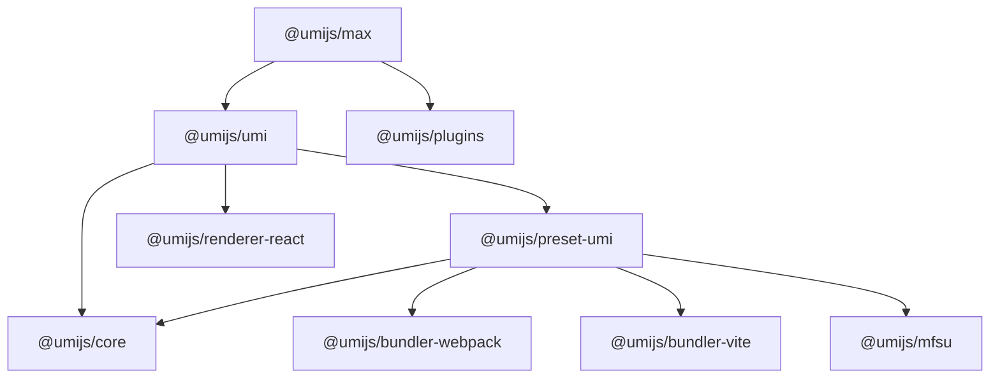

# UmiJS 概览

## 什么是 UmiJS

UmiJS（发音为 "You-Me-Jay-S"）是一个可扩展的企业级前端应用框架。它由蚂蚁集团体验技术部开发和维护，自 2017 年开源以来，已成为 React 社区最受欢迎的项目之一。

> Umi 以路由为基础的，支持配置式路由和约定式路由，内置按需编译、luas 加速、SSR、mock、基山县、主题定制等。

::: tip 设计哲学
Umi 的核心设计哲学可以概括为两点：**约定式路由**和**插件化架构**。这两个理念贯穿了整个框架的设计与实现。
:::

### 核心特性

1. **插件化架构** 🧩
   - 基于 Hook 机制的插件系统
   - 支持编译时插件和运行时插件
   - Preset 插件集合机制
   - 丰富的官方和社区插件生态

2. **路由系统** 🛣️
   - 约定式路由：基于文件系统的自动路由生成
   - 配置式路由：通过配置文件定义路由结构
   - 支持嵌套路由、动态路由、权限路由
   - 路由预加载、懒加载

3. **构建系统** ⚡
   - 支持 Webpack、Vite、ESBuild 多种打包器
   - 1:1 源码到产物的映射
   - 支持 MFSU（Module Federation Speed Up）
   - 按需编译、代码分割

4. **开发体验** 🎨
   - 开箱即用的 TypeScript 支持
   - 零配置启动
   - 热更新（HMR）
   - 内置 Mock 数据
   - 调试工具

## 设计哲学深度解析

### 约定优于配置（Convention Over Configuration）

Umi 的约定式路由是其最显著的特色之一。这个理念来源于 Ruby on Rails，核心思想是通过合理的默认约定减少配置成本。

#### 约定式路由的实现原理

在 Umi 中，`pages` 目录下的文件结构自动映射为应用的路由结构：

```
src/pages/
├── index.tsx          # /
├── user/
│   ├── index.tsx      # /user
│   └── [id].tsx       # /user/:id
└── settings/
    ├── profile.tsx    # /settings/profile
    └── security.tsx   # /settings/security
```

源码中，这个功能在 [`@umijs/preset-umi`](https://github.com/umijs/umi/tree/master/packages/preset-umi) 的 `tmpFiles` 插件中实现：

```typescript
// packages/preset-umi/src/features/tmpFiles/routes.ts
export async function getRoutes(opts: { api: IApi }) {
  const { api } = opts;
  
  // 1. 优先使用配置式路由
  if (api.userConfig.routes) {
    return api.userConfig.routes;
  }
  
  // 2. 使用约定式路由
  const routesConvention = new RoutesConvention({
    absPagesPath: api.paths.absPagesPath,
    // ...
  });
  
  return routesConvention.getRoutes();
}
```

### 插件化架构（Plugin Architecture）

Umi 的插件系统是框架的灵魂所在。整个框架的核心功能几乎全部通过插件实现，包括：

- 配置系统
- 路由系统
- 构建系统
- 运行时系统
- 各种特性（Mock、SSR、PWA 等）

#### 插件系统架构

```
┌─────────────────────────────────────────────────────────┐
│                    Umi Application                       │
├─────────────────────────────────────────────────────────┤
│                   Runtime Plugins                        │
│  (定义在 src/app.ts 中，客户端运行时执行)                │
├─────────────────────────────────────────────────────────┤
│                    Preset-Umi                            │
│  ├── configPlugins (配置处理)                            │
│  ├── tmpFiles (生成临时文件)                            │
│  ├── webpack (Webpack 打包器)                           │
│  ├── vite (Vite 打包器)                                 │
│  ├── mfsu (模块联邦加速)                                │
│  └── ... 更多特性插件                                   │
├─────────────────────────────────────────────────────────┤
│                    @umijs/core                          │
│  ├── Service (核心服务类)                               │
│  ├── PluginAPI (插件 API)                               │
│  ├── Config (配置系统)                                  │
│  └── Route (路由系统)                                   │
└─────────────────────────────────────────────────────────┘
```

#### 核心 Service 类

[`@umijs/core`](https://github.com/umijs/umi/tree/master/packages/core) 包中的 `Service` 类是整个框架的核心引擎：

```typescript
// packages/core/src/service/service.ts
export class Service {
  // 插件注册表
  plugins: Record<string, Plugin> = {};
  
  // Hook 注册表
  hooks: Record<string, Hook[]> = {};
  
  // 命令注册表
  commands: Record<string, Command> = {};
  
  // 应用插件
  async applyPlugins<T>(opts: {
    key: string;
    type?: ApplyPluginsType;
    initialValue?: any;
    args?: any;
  }): Promise<T> {
    // 按 Hook 类型执行插件
    // - event: 事件类型，无返回值，依次执行
    // - modify: 修改类型，链式调用，传递修改结果
    // - add: 添加类型，收集所有插件的返回值
  }
  
  // 运行生命周期
  async run(opts: { name: string; args?: any }) {
    // 1. 加载环境变量
    // 2. 读取用户配置
    // 3. 注册 Presets 和 Plugins
    // 4. 解析配置
    // 5. 收集应用数据
    // 6. 执行命令
  }
}
```

## Monorepo 架构

Umi 采用 Monorepo 架构管理，使用 pnpm + Turborepo 进行依赖管理和构建优化。

### 包结构

```
umi/
├── packages/
│   ├── core/              # 核心服务、配置、路由
│   ├── umi/               # 主包、CLI、客户端运行时
│   ├── preset-umi/        # Umi Preset 实现
│   ├── renderer-react/    # React 渲染器
│   ├── bundler-webpack/   # Webpack 打包器
│   ├── bundler-vite/      # Vite 打包器
│   ├── bundler-esbuild/   # ESBuild 打包器
│   ├── mfsu/              # 模块联邦加速
│   ├── plugins/           # 插件集合
│   └── max/               # 全功能版本
├── docs/                  # 官方文档
├── examples/              # 示例项目
└── package.json
```

### 包依赖关系



## 版本演进

### Umi 1.x (2017)
- 初始版本，基于 React Router v3
- 开箱即用的路由、构建能力

### Umi 2.x (2018-2020)
- 引入插件化架构
- 支持多页应用（MPA）
- 集成 Dva、Ant Design Pro

### Umi 3.x (2020-2022)
- 全面的 TypeScript 支持
- 引入 MFSU 加速构建
- 支持 SSR

### Umi 4.x (2022-至今)
- 重构为纯 TypeScript
- 支持 Vite 打包器
- 引入 ⚡️ Forget 模式
- 更轻量、更快速

## 学习路线

本文档将带你深入 UmiJS 的源码世界，按照以下路径进行：

1. **指南篇** - 快速上手，了解项目结构和调试方法
2. **架构篇** - 理解整体架构、插件系统、配置系统、路由系统
3. **核心篇** - 深入各个核心模块的实现细节
4. **进阶篇** - 探索 AST 转换、微前端集成、性能优化

::: warning 阅读建议
本文档面向有经验的开发者阅读。建议你有：
- TypeScript 基础
- React 开发经验
- 对前端构建工具（Webpack/Vite）有基本了解
:::

## 参考资源

- [UmiJS 官方文档](https://umijs.org/)
- [GitHub 仓库](https://github.com/umijs/umi)
- [UmiJS 官方博客](https://umijs.org/blog)
- [Ant Design Pro](https://pro.ant.design/)

---

📖 **下一篇**: [快速开始](/guide/quick-start)